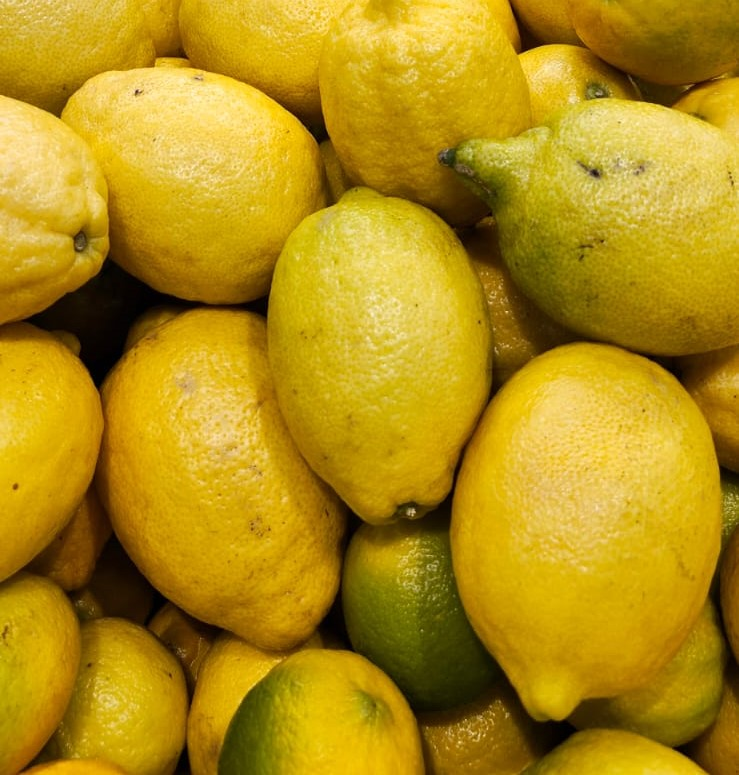
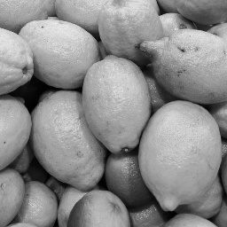

# Image Processing Filtering Functions

## Abstract
In this Image Processing course, we were tasked with implementing several common filters used in classic image processing. The goal was to understand the complexity, method of operation, and thought process behind these filters, which are often applied with a single line of code in modern libraries. We used a photo of a lemon stand from a supermarket, taken on our phones, to examine the effects of these filters. Additionally, we compared the results and runtime of our implementations with the equivalent functions in OpenCV (cv2).

## Methods and Libraries
We utilized the following libraries in our project:
- `numpy` for creating matrices (filters and images)
- `cv2` for preprocessing images, displaying results, and saving images
- `time` for measuring the runtime of our functions

### Part 1: Linear Filtering Function
We implemented a function that accepts a square image, a square (linear) filter, and a type of padding. The padding types were:
- 0: zero-padding
- 1: replicate-padding
- 2: mirror-padding

We ensured the output image maintained the same dimensions as the input image. After implementing the paddings, we performed convolution on the padded image and stored the results in the output image.

### Part 2: Non-Linear Filtering Function
We implemented a function for non-linear filters, which accepts a square image, a non-linear filter, its dimensions, and a type of padding. Unlike the linear filter, the non-linear filter could have different row and column dimensions. We used `numpy` functions for median and average calculations, as these were the non-linear filters we implemented.

## Results and Discussion
We applied various filters to our image, comparing our implementations with the corresponding OpenCV functions.

### Original Image
<p align="center">


</p>

### Grayscale Image

*Original vs. Grayscale image.*

### Smoothing
#### Our Implementation


#### Library Function

*Differences, if any, are non-visible to the naked eye.*

### Sharpening
#### Our Implementation


#### Library Function

*Our image appears overly sharpened compared to the library function, even though the same filter (one-pass Laplace filter) was applied.*

### Median Filter

*The image appears slightly smudged but maintains most of its quality.*

### Salt and Pepper Noise

*The image appears grainy.*

#### Smoothed Salt and Pepper Noise

*After applying our smoothing operation, the noise is still visible, and the entire image appears blurry.*

### Runtime Comparison
Our implementations took approximately 1.4 seconds to execute, while the library functions were significantly faster (less than 0.001 seconds). This difference is likely due to optimizations in the library functions that we were not aware of, as well as more complex and efficient calculation methods used by the library.

## Summary
This project required us to implement common filtering functions in classic image processing. We broke down each part of the assignment and tackled them individually to achieve the required goals. Through this process, we gained a deeper understanding of the complexity and operations of these filters and viewed their effects on our images.

## Acknowledgments
We used ChatGPT to assist with understanding and implementation ideas, using prompts such as:
- "how to make image sharper using cv2"
- "how to make image sharper without cv2"
- "common non-linear filters in image processing"
- "explain median filter"

## Appendix
### Code
#### Convolution Function
```python
# Part 1 functions
# Linear Filter Function (inc. padding)
